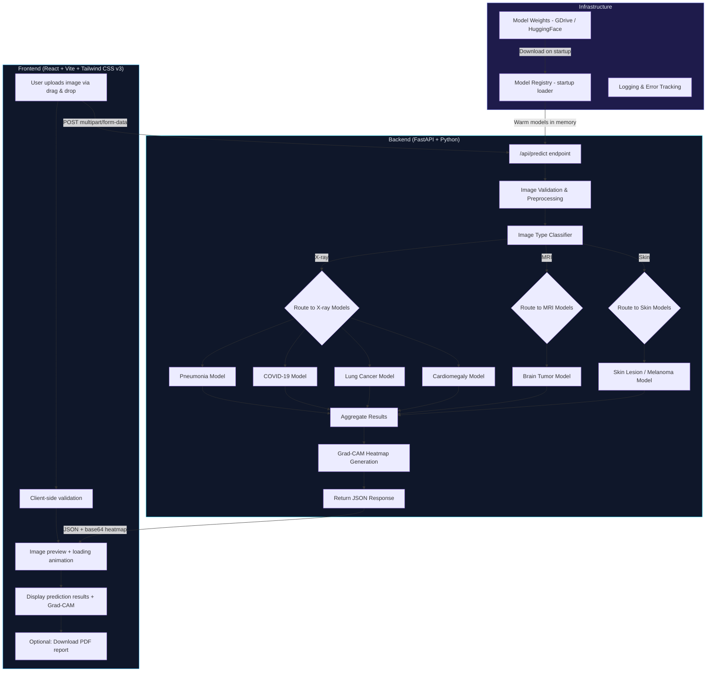
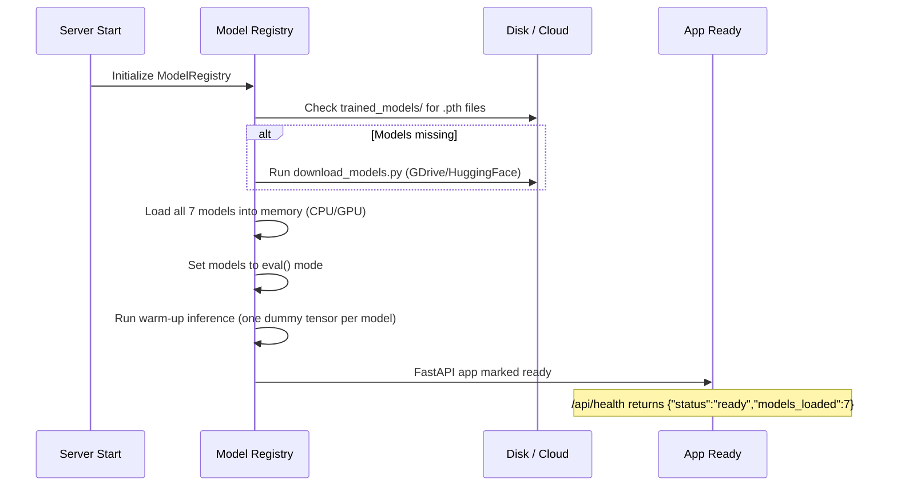
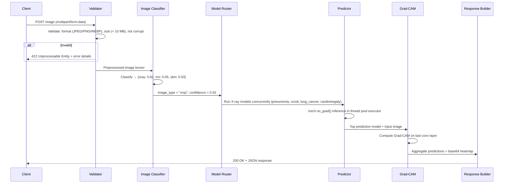
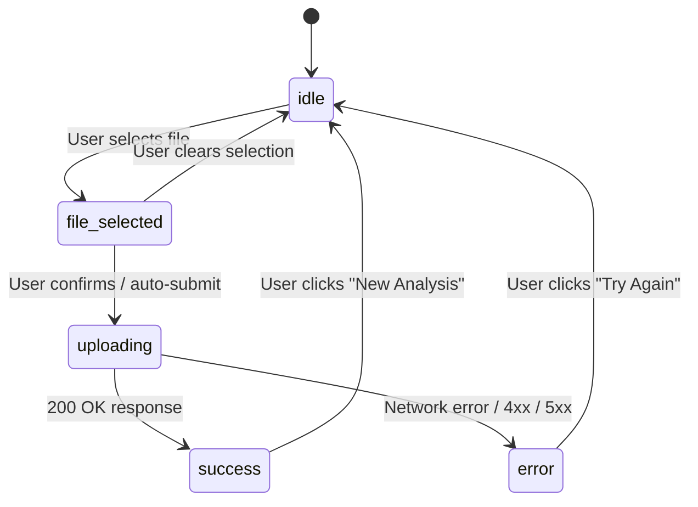

# 🏥 Healthcare Deep Learning — Final Implementation Plan

## 1. Overview

Build a production-grade web application where a user uploads a medical image (X-ray, MRI, or skin photo) and the system **automatically detects the image type**, routes it to the correct disease model(s), and returns prediction probabilities with Grad-CAM heatmap visualization — **without asking the user to choose anything**.

### Key Principles

| Principle | Detail |
|-----------|--------|
| **Zero-choice UX** | User only uploads; system handles classification + routing |
| **Dummy-first pipeline** | Full app works end-to-end with random-weight models before any real training |
| **Modular model swap** | Drop in a trained `.pth` file → system picks it up automatically |
| **Free deployment** | Render (backend) + Vercel (frontend), zero cost |
| **Medical disclaimer everywhere** | Every response and every page makes clear this is NOT a diagnosis |

---

## 2. System Architecture



---

## 3. Project Folder Structure

```
d:\healthcareDeep_Learning\main\
├── backend/
│   ├── app/
│   │   ├── __init__.py
│   │   ├── main.py                  # FastAPI app entry + startup events (model loading, CORS)
│   │   ├── config.py                # Settings, constants, env var loading
│   │   ├── routes/
│   │   │   ├── __init__.py
│   │   │   ├── predict.py           # POST /api/predict — accepts image, returns predictions
│   │   │   ├── health.py            # GET  /api/health — liveness + model readiness check
│   │   │   └── report.py            # POST /api/report — generate & return PDF report
│   │   ├── services/
│   │   │   ├── __init__.py
│   │   │   ├── image_classifier.py  # Auto-detect image type (X-ray / MRI / Skin)
│   │   │   ├── model_router.py      # Route image to correct model(s) based on type
│   │   │   ├── model_registry.py    # Load, cache, and serve all models at startup
│   │   │   ├── predictor.py         # Run inference on disease models (async-safe)
│   │   │   └── gradcam.py           # Grad-CAM heatmap generation
│   │   ├── models/
│   │   │   ├── __init__.py
│   │   │   ├── schemas.py           # Pydantic request/response schemas
│   │   │   └── architectures.py     # Model architecture definitions (reused in training)
│   │   └── utils/
│   │       ├── __init__.py
│   │       ├── image_processing.py  # Resize, normalize, per-model transforms
│   │       ├── validators.py        # File type/size/corruption validation
│   │       ├── logger.py            # Structured JSON logging
│   │       └── pdf_report.py        # PDF report generation (ReportLab)
│   ├── trained_models/              # .pth model weights (gitignored, downloaded at startup)
│   │   └── .gitkeep
│   ├── tests/
│   │   ├── __init__.py
│   │   ├── test_health.py           # Health endpoint tests
│   │   ├── test_predict.py          # Prediction endpoint tests
│   │   ├── test_image_classifier.py # Image type classification tests
│   │   └── conftest.py              # Shared fixtures (test client, sample images)
│   ├── scripts/
│   │   └── download_models.py       # Download model weights from cloud storage
│   ├── requirements.txt
│   ├── Dockerfile
│   ├── .env.example
│   └── .gitignore
│
├── frontend/
│   ├── public/
│   │   └── favicon.svg              # Medical-themed favicon
│   ├── src/
│   │   ├── components/
│   │   │   ├── UploadZone.jsx       # Drag & drop + click-to-upload with file validation
│   │   │   ├── ImagePreview.jsx     # Shows uploaded image thumbnail with type badge
│   │   │   ├── PredictionResults.jsx# Animated probability bars with percentages
│   │   │   ├── GradCamView.jsx      # Grad-CAM heatmap overlay on original image
│   │   │   ├── LoadingSpinner.jsx   # Animated DNA helix / heartbeat loading
│   │   │   ├── MedicalDisclaimer.jsx# Persistent warning banner
│   │   │   ├── Header.jsx           # App header with logo + nav
│   │   │   ├── Footer.jsx           # Footer with credits + disclaimer link
│   │   │   ├── ErrorBanner.jsx      # User-friendly error display
│   │   │   └── ReportDownload.jsx   # Download PDF report button
│   │   ├── hooks/
│   │   │   └── usePrediction.js     # Custom hook: upload → loading → result state machine
│   │   ├── pages/
│   │   │   └── Home.jsx             # Main single-page layout
│   │   ├── services/
│   │   │   └── api.js               # Axios instance + API calls
│   │   ├── constants/
│   │   │   └── index.js             # Allowed file types, max size, API URL
│   │   ├── App.jsx
│   │   ├── main.jsx
│   │   └── index.css                # Tailwind directives + custom styles
│   ├── tailwind.config.js
│   ├── postcss.config.js
│   ├── vite.config.js
│   ├── package.json
│   └── index.html
│
├── training/
│   ├── config.py                    # Hyperparams, paths, device selection, seed
│   ├── dataset.py                   # Custom PyTorch Dataset + augmentations
│   ├── train.py                     # Generic training loop with early stopping
│   ├── evaluate.py                  # Metrics: Precision, Recall, F1, ROC-AUC, Confusion Matrix
│   ├── train_image_classifier.py    # Train image-type classifier (X-ray/MRI/Skin)
│   ├── train_brain_tumor.py         # Train brain tumor model (4-class)
│   ├── train_pneumonia.py           # Train pneumonia model (2-class)
│   ├── train_covid.py               # Train COVID-19 model (3-class)
│   ├── train_skin_lesion.py         # Train skin lesion model (multi-class)
│   ├── train_lung_cancer.py         # Train lung cancer model (3-class)
│   ├── train_cardiomegaly.py        # Train cardiomegaly model (2-class)
│   └── requirements.txt
│
├── datasets/
│   └── README.md                    # Download links, folder structure, licensing info
│
└── README.md                        # Full project documentation + quickstart
```

### Additions vs. Original Plan

| New File/Dir | Why |
|---|---|
| `model_registry.py` | Centralized model loading, caching, warm-up at startup — avoids per-request model I/O |
| `architectures.py` | Shared model architecture definitions reused by both backend and training scripts |
| `validators.py` | Dedicated image validation (format, size, corruption) before hitting inference |
| `routes/report.py` | Separate endpoint for PDF generation — keeps `/api/predict` fast |
| `tests/` | Backend test suite with pytest |
| `scripts/download_models.py` | Automated model weight downloader |
| `hooks/usePrediction.js` | Frontend state machine hook for clean upload → loading → result flow |
| `constants/index.js` | Centralized frontend constants (file size limits, allowed types, API URL) |
| `ErrorBanner.jsx` | Proper user-facing error display component |
| `ReportDownload.jsx` | Dedicated report download button component |

---

## 4. Model Specifications

### 4.1 Model Table

| # | Model | Image Type | Architecture | Classes | Input Size | Dataset Source |
|---|-------|-----------|--------------|---------|-----------|----------------|
| 0 | **Image Type Classifier** | Any | EfficientNet-B0 | 3 (xray, mri, skin) | 224×224 | Combined samples from all datasets |
| 1 | **Brain Tumor** | MRI | ResNet50 | 4 (glioma, meningioma, pituitary, no_tumor) | 224×224 | [Kaggle Brain Tumor MRI](https://www.kaggle.com/datasets/masoudnickparvar/brain-tumor-mri-dataset) |
| 2 | **Pneumonia** | Chest X-ray | EfficientNet-B0 | 2 (normal, pneumonia) | 224×224 | [Kaggle Chest X-ray](https://www.kaggle.com/datasets/paultimothymooney/chest-xray-pneumonia) |
| 3 | **COVID-19** | Chest X-ray | EfficientNet-B0 | 3 (normal, covid, viral_pneumonia) | 224×224 | [COVID-19 Radiography](https://www.kaggle.com/datasets/tawsifurrahman/covid19-radiography-database) |
| 4 | **Skin Lesion** | Skin photo | EfficientNet-B0 | 7 (akiec, bcc, bkl, df, mel, nv, vasc) | 224×224 | [HAM10000](https://www.kaggle.com/datasets/kmader/skin-cancer-mnist-ham10000) |
| 5 | **Lung Cancer** | CT/X-ray | ResNet50 | 3 (normal, benign, malignant) | 224×224 | [IQ-OTHNCCD](https://www.kaggle.com/datasets/adityamahimkar/iqothnccd-lung-cancer-dataset) |
| 6 | **Cardiomegaly** | Chest X-ray | EfficientNet-B0 | 2 (normal, cardiomegaly) | 224×224 | [NIH ChestX-ray14](https://www.kaggle.com/datasets/nih-chest-xrays/data) (filtered) |

### 4.2 Training Configuration (All Models)

```python
# Shared defaults — individual scripts can override
TRAINING_CONFIG = {
    "optimizer": "Adam",
    "learning_rate": 1e-4,
    "weight_decay": 1e-5,
    "loss_function": "CrossEntropyLoss",            # + class weights for imbalanced datasets
    "scheduler": "ReduceLROnPlateau",
    "scheduler_patience": 3,
    "scheduler_factor": 0.5,
    "epochs": 50,
    "batch_size": 32,
    "early_stopping_patience": 7,                   # Stop if val_loss doesn't improve for 7 epochs
    "input_size": (224, 224),
    "seed": 42,
    "data_split": {"train": 0.7, "val": 0.15, "test": 0.15},  # Stratified split
    "num_workers": 4,
    "pin_memory": True,
}
```

### 4.3 Data Augmentation Pipeline

```python
# Training transforms
train_transforms = transforms.Compose([
    transforms.Resize((256, 256)),
    transforms.RandomResizedCrop(224, scale=(0.8, 1.0)),
    transforms.RandomHorizontalFlip(p=0.5),
    transforms.RandomRotation(degrees=15),
    transforms.ColorJitter(brightness=0.2, contrast=0.2, saturation=0.1),
    transforms.ToTensor(),
    transforms.Normalize(mean=[0.485, 0.456, 0.406], std=[0.229, 0.224, 0.225]),
])

# Validation/Test transforms (no augmentation)
val_transforms = transforms.Compose([
    transforms.Resize((256, 256)),
    transforms.CenterCrop(224),
    transforms.ToTensor(),
    transforms.Normalize(mean=[0.485, 0.456, 0.406], std=[0.229, 0.224, 0.225]),
])
```

### 4.4 Evaluation Metrics

Every model reports on the held-out test set:
- **Accuracy** (overall)
- **Precision** (per-class + macro avg)
- **Recall / Sensitivity** (per-class + macro avg)
- **F1-Score** (per-class + macro avg)
- **ROC-AUC** (one-vs-rest, macro avg)
- **Confusion Matrix** (plotted with seaborn)

### 4.5 Per-Model Preprocessing at Inference

While all models share the same ImageNet normalization, the backend applies transforms per model to allow future flexibility:

```python
MODEL_TRANSFORMS = {
    "image_classifier": val_transforms,
    "brain_tumor":      val_transforms,
    "pneumonia":        val_transforms,
    "covid":            val_transforms,
    "skin_lesion":      val_transforms,
    "lung_cancer":      val_transforms,
    "cardiomegaly":     val_transforms,
}
```

This dictionary lives in `config.py` so any model can be switched to a different input pipeline without touching inference code.

---

## 5. Backend Design (Detailed)

### 5.1 Startup Lifecycle



### 5.2 Request Pipeline (`/api/predict`)



### 5.3 CORS Configuration

```python
# main.py
from fastapi.middleware.cors import CORSMiddleware

app.add_middleware(
    CORSMiddleware,
    allow_origins=[
        "http://localhost:5173",       # Vite dev server
        "https://your-app.vercel.app", # Production frontend
    ],
    allow_credentials=True,
    allow_methods=["*"],
    allow_headers=["*"],
)
```

### 5.4 Thread Safety & Async Inference

PyTorch inference is CPU-bound and synchronous. To avoid blocking FastAPI's event loop:

```python
# predictor.py
import asyncio
from concurrent.futures import ThreadPoolExecutor

_executor = ThreadPoolExecutor(max_workers=2)

async def run_inference(model, tensor):
    """Run PyTorch inference in a thread pool to avoid blocking the event loop."""
    loop = asyncio.get_event_loop()
    return await loop.run_in_executor(_executor, _sync_inference, model, tensor)

def _sync_inference(model, tensor):
    with torch.no_grad():
        output = model(tensor.unsqueeze(0))
        probabilities = torch.softmax(output, dim=1)
    return probabilities.squeeze().tolist()
```

### 5.5 Environment Variables (`.env.example`)

```env
# Server
HOST=0.0.0.0
PORT=8000
ENV=development               # development | production
LOG_LEVEL=info

# CORS
FRONTEND_URL=http://localhost:5173

# Models
MODEL_DIR=./trained_models
MODEL_DOWNLOAD_URL=https://drive.google.com/...
USE_GPU=false                  # Set to true if CUDA is available

# Limits
MAX_FILE_SIZE_MB=10
```

### 5.6 Image Validation Rules

| Check | Rule | HTTP Error |
|-------|------|-----------|
| File type | Must be `image/jpeg`, `image/png`, or `image/webp` | 422 |
| File size | Must be ≤ 10 MB | 413 |
| Corruption | Must be openable by PIL | 422 |
| Dimensions | Must be at least 32×32 px | 422 |
| Color mode | Converted to RGB if grayscale/RGBA | — (auto-convert) |

---

## 6. API Specification

### 6.1 Endpoints

| Method | Path | Description | Auth |
|--------|------|-------------|------|
| `GET` | `/api/health` | Liveness check + model readiness | None |
| `POST` | `/api/predict` | Upload image → get predictions | None |
| `POST` | `/api/report` | Generate PDF report from prediction results | None |

### 6.2 `GET /api/health` Response

```json
{
  "status": "ready",
  "models_loaded": 7,
  "gpu_available": false,
  "version": "1.0.0"
}
```

### 6.3 `POST /api/predict`

**Request**: `multipart/form-data` with field `file` (image)

**Response** (`200 OK`):

```json
{
  "image_type": {
    "detected": "xray",
    "confidence": 0.92,
    "probabilities": {
      "xray": 0.92,
      "mri": 0.05,
      "skin": 0.03
    }
  },
  "predictions": [
    { "disease": "Pneumonia",    "probability": 0.87, "status": "high_risk" },
    { "disease": "COVID-19",     "probability": 0.12, "status": "low_risk" },
    { "disease": "Lung Cancer",  "probability": 0.08, "status": "low_risk" },
    { "disease": "Cardiomegaly", "probability": 0.03, "status": "low_risk" }
  ],
  "top_prediction": {
    "disease": "Pneumonia",
    "probability": 0.87,
    "status": "high_risk"
  },
  "gradcam": {
    "image": "data:image/png;base64,iVBOR...",
    "model_used": "pneumonia"
  },
  "processing_time_ms": 342,
  "disclaimer": "This is an AI-assisted screening tool. Results are NOT a medical diagnosis. Please consult a qualified healthcare professional."
}
```

**Risk thresholds**: `high_risk` ≥ 0.7, `medium_risk` ≥ 0.4, `low_risk` < 0.4

**Error Response** (`422`):

```json
{
  "detail": "Invalid image: file is not a supported format. Accepted: JPEG, PNG, WEBP."
}
```

### 6.4 `POST /api/report`

**Request**: `application/json` body containing the prediction response (from `/api/predict`) + the original image as base64.

**Response**: PDF file as `application/pdf` download.

---

## 7. Frontend Design (Detailed)

### 7.1 Design System

| Token | Value |
|-------|-------|
| **Primary** | `#0ea5e9` (Sky 500) — Medical blue |
| **Secondary** | `#14b8a6` (Teal 500) — Accent |
| **Background** | `#0f172a` (Slate 900) — Dark mode default |
| **Surface** | `#1e293b` (Slate 800) — Cards, panels |
| **Text Primary** | `#f1f5f9` (Slate 100) |
| **Text Secondary** | `#94a3b8` (Slate 400) |
| **Danger** | `#ef4444` (Red 500) — High risk |
| **Warning** | `#f59e0b` (Amber 500) — Medium risk |
| **Success** | `#22c55e` (Green 500) — Low risk / Normal |
| **Font** | Inter (Google Fonts) |
| **Border Radius** | `0.75rem` (cards), `0.5rem` (buttons) |

### 7.2 Component Breakdown

#### `UploadZone.jsx`
- Drag-and-drop area with dashed border animation
- Click-to-browse fallback
- Client-side validation: file type, file size (< 10 MB)
- Shows file name + size after selection
- Accessible: keyboard navigable, `aria-label`, focus ring
- **States**: idle → file-selected → uploading → done/error

#### `ImagePreview.jsx`
- Shows uploaded image thumbnail (max 400px width)
- Displays detected image type badge (e.g., "X-RAY" in a pill)
- Subtle entrance animation (fade + scale)

#### `PredictionResults.jsx`
- Horizontal animated progress bars for each disease
- Color-coded by risk level (red/amber/green)
- Shows percentage label + disease name
- Top prediction highlighted with a glow effect
- Staggered entrance animation

#### `GradCamView.jsx`
- Side-by-side or overlay toggle: original image vs. heatmap
- Opacity slider for heatmap overlay
- Caption explaining what Grad-CAM shows

#### `LoadingSpinner.jsx`
- Animated CSS heartbeat / pulse animation
- "Analyzing your image..." text
- Estimated time indicator

#### `MedicalDisclaimer.jsx`
- Persistent yellow/amber banner at top
- Cannot be dismissed (intentional — medical compliance)
- Clear language: "This tool is for educational purposes only"

#### `ErrorBanner.jsx`
- Red banner with error message
- Retry button
- Auto-dismiss after 10 seconds (or on new upload)

#### `ReportDownload.jsx`
- Button appears after predictions are shown
- Triggers PDF generation via `/api/report`
- Shows download progress

#### `Header.jsx`
- App logo (🏥 + text)
- Minimal nav — this is a single-page app
- Glassmorphism background

#### `Footer.jsx`
- Credits, GitHub link
- Brief disclaimer repeat
- Tech stack badges

### 7.3 State Machine (`usePrediction` hook)



### 7.4 Responsive Breakpoints

| Breakpoint | Layout |
|-----------|--------|
| `< 640px` (mobile) | Single column, stacked components |
| `640px–1024px` (tablet) | Two-column: upload left, results right |
| `> 1024px` (desktop) | Centered max-width container, two-column |

### 7.5 Accessibility Requirements

- All images have `alt` text
- All interactive elements are keyboard navigable
- Focus indicators on all focusable elements
- Color is never the only indicator (icons + text alongside color-coded bars)
- `aria-live="polite"` on results area for screen reader announcements
- Sufficient color contrast (WCAG AA minimum)

---

## 8. Grad-CAM Implementation

### How it works:
1. Forward pass the image through the **top-predicted disease model**
2. Hook into the **last convolutional layer** (e.g., `layer4` for ResNet50, `features[-1]` for EfficientNet)
3. Backward pass from the predicted class score
4. Compute weighted combination of feature map activations
5. ReLU → resize to input dimensions → apply colormap → overlay on original image

### Output:
- Base64-encoded PNG of the heatmap overlaid on the original image
- Returned in the `/api/predict` response under `gradcam.image`

### Implementation detail:

```python
class GradCAM:
    def __init__(self, model, target_layer):
        self.model = model
        self.target_layer = target_layer
        self.gradients = None
        self.activations = None
        self._register_hooks()

    def _register_hooks(self):
        self.target_layer.register_forward_hook(self._save_activation)
        self.target_layer.register_full_backward_hook(self._save_gradient)

    def _save_activation(self, module, input, output):
        self.activations = output.detach()

    def _save_gradient(self, module, grad_input, grad_output):
        self.gradients = grad_output[0].detach()

    def generate(self, input_tensor, class_idx):
        output = self.model(input_tensor)
        self.model.zero_grad()
        output[0, class_idx].backward()

        weights = self.gradients.mean(dim=[2, 3], keepdim=True)
        cam = (weights * self.activations).sum(dim=1, keepdim=True)
        cam = torch.relu(cam)
        cam = cam / (cam.max() + 1e-8)
        return cam.squeeze().cpu().numpy()
```

---

## 9. PDF Report Structure

Generated with **ReportLab**. Contains:

1. **Header**: "Medical Image Analysis Report" + timestamp
2. **Patient Disclaimer**: Bold warning that this is not a diagnosis
3. **Uploaded Image**: Embedded at reduced size
4. **Detected Image Type**: e.g., "Chest X-ray (confidence: 92%)"
5. **Prediction Results Table**: Disease | Probability | Risk Level
6. **Top Prediction Highlight**: Boxed callout
7. **Grad-CAM Heatmap**: Embedded image
8. **Grad-CAM Explanation**: Brief text explaining highlighted regions
9. **Footer**: "Generated by Healthcare DL System — For educational purposes only"

---

## 10. Security & Robustness

| Concern | Mitigation |
|---------|-----------|
| **Malicious file upload** | Validate MIME type via `python-magic`, verify with PIL open, restrict extensions |
| **Oversized uploads** | 10 MB limit enforced at both Nginx/proxy and FastAPI level |
| **Denial of service** | Rate limiting via `slowapi` — 10 requests/minute per IP |
| **CORS** | Whitelist only the frontend origin |
| **Error leakage** | Custom exception handlers — never expose stack traces in production |
| **Model tampering** | Checksum verification on downloaded model weights |
| **Dependency vulnerabilities** | Pin all dependencies in `requirements.txt` with exact versions |

---

## 11. Deployment Architecture

### 11.1 Backend → Render (Free Tier)

```dockerfile
# Multi-stage Dockerfile
FROM python:3.11-slim AS base

WORKDIR /app
COPY requirements.txt .
RUN pip install --no-cache-dir -r requirements.txt

COPY app/ ./app/
COPY scripts/ ./scripts/
COPY trained_models/ ./trained_models/

# Download models if not present
RUN python scripts/download_models.py

EXPOSE 8000
CMD ["uvicorn", "app.main:app", "--host", "0.0.0.0", "--port", "8000"]
```

**Render free tier considerations**:
- 512 MB RAM — models must fit in memory (EfficientNet-B0 ≈ 20 MB each, ResNet50 ≈ 100 MB)
- Total estimated memory: ~300 MB for 7 models → fits in 512 MB
- Cold start: ~30s (model loading) — mitigated by health check keep-alive
- Spins down after 15 min inactivity

### 11.2 Frontend → Vercel

- Zero config for Vite + React
- Environment variable: `VITE_API_URL` pointing to Render backend
- Automatic HTTPS
- Global CDN

### 11.3 Model Weights → HuggingFace Hub

- Upload `.pth` files to a HuggingFace repository
- `download_models.py` pulls them via `huggingface_hub` library
- Fallback: Google Drive with `gdown`

---

## 12. Phased Implementation Plan

### Phase 1 — Project Setup & Scaffolding
> **Goal**: Both frontend and backend running locally, connected via health endpoint.

| Step | Task | Details | Est. |
|------|------|---------|------|
| 1.1 | Backend init | FastAPI app scaffold, `config.py`, `.env`, CORS, logging | 15 min |
| 1.2 | Health endpoint | `GET /api/health` returning status JSON | 5 min |
| 1.3 | Frontend init | Vite + React + Tailwind CSS v3, design system setup | 15 min |
| 1.4 | Connectivity test | Frontend calls `/api/health`, displays status | 10 min |

---

### Phase 2 — Backend Core (Dummy Models)
> **Goal**: Complete backend inference pipeline with random-weight models.

| Step | Task | Details | Est. |
|------|------|---------|------|
| 2.1 | Model architectures | Define EfficientNet-B0 and ResNet50 wrappers in `architectures.py` | 15 min |
| 2.2 | Model registry | `model_registry.py` — load all 7 models at startup, eval mode, warm-up | 20 min |
| 2.3 | Image validation | `validators.py` — file type, size, corruption, dimensions | 10 min |
| 2.4 | Image preprocessing | `image_processing.py` — per-model transforms, RGB conversion | 10 min |
| 2.5 | Image type classifier | `image_classifier.py` — classify input as xray/mri/skin | 10 min |
| 2.6 | Model router | `model_router.py` — route to correct disease model(s) based on type | 10 min |
| 2.7 | Predictor service | `predictor.py` — async-safe inference with thread pool executor | 15 min |
| 2.8 | Pydantic schemas | `schemas.py` — request/response models with examples | 10 min |
| 2.9 | Predict endpoint | `predict.py` — wire everything into POST `/api/predict` | 15 min |
| 2.10 | Error handling | Custom exception handlers, structured error responses | 10 min |
| 2.11 | Backend tests | Pytest tests for health + predict endpoints | 15 min |

---

### Phase 3 — Frontend UI
> **Goal**: Beautiful, dark-mode, medical-themed UI with full upload → results flow.

| Step | Task | Details | Est. |
|------|------|---------|------|
| 3.1 | Design system | Tailwind config (colors, fonts, animations), `index.css` | 15 min |
| 3.2 | Header + Footer | App shell with glassmorphism header, credits footer | 15 min |
| 3.3 | MedicalDisclaimer | Persistent amber warning banner | 5 min |
| 3.4 | UploadZone | Drag & drop + click upload with animations | 20 min |
| 3.5 | ImagePreview | Image thumbnail + detected type badge | 10 min |
| 3.6 | LoadingSpinner | Heartbeat/DNA animation | 10 min |
| 3.7 | PredictionResults | Animated color-coded probability bars | 20 min |
| 3.8 | GradCamView | Heatmap overlay with toggle | 15 min |
| 3.9 | ErrorBanner | Error display component | 5 min |
| 3.10 | API service | Axios instance + `predictImage()` function | 10 min |
| 3.11 | usePrediction hook | State machine: idle → uploading → success/error | 10 min |
| 3.12 | Home page | Wire all components together | 15 min |
| 3.13 | Responsive polish | Test mobile/tablet/desktop layouts | 10 min |

---

### Phase 4 — Training Scripts
> **Goal**: Complete, runnable training scripts for all 7 models with early stopping.

| Step | Task | Details | Est. |
|------|------|---------|------|
| 4.1 | Training infrastructure | `config.py`, `dataset.py`, `train.py` (with early stopping), `evaluate.py` | 30 min |
| 4.2 | Image type classifier | 3-class EfficientNet-B0 on combined dataset | 15 min |
| 4.3 | Brain tumor model | 4-class ResNet50 on Kaggle Brain Tumor MRI | 15 min |
| 4.4 | Pneumonia model | 2-class EfficientNet-B0 on Chest X-ray | 15 min |
| 4.5 | COVID-19 model | 3-class EfficientNet-B0 on COVID Radiography | 15 min |
| 4.6 | Skin lesion model | 7-class EfficientNet-B0 on HAM10000 | 15 min |
| 4.7 | Lung cancer model | 3-class ResNet50 on IQ-OTHNCCD | 15 min |
| 4.8 | Cardiomegaly model | 2-class EfficientNet-B0 on NIH (filtered) | 15 min |
| 4.9 | Dataset README | Download links, expected folder structure, licensing | 10 min |

---

### Phase 5 — Advanced Features
> **Goal**: Grad-CAM visualization and downloadable PDF report.

| Step | Task | Details | Est. |
|------|------|---------|------|
| 5.1 | Grad-CAM service | `gradcam.py` — heatmap generation from last conv layer | 20 min |
| 5.2 | Integrate Grad-CAM | Add heatmap to `/api/predict` response | 10 min |
| 5.3 | PDF report | `pdf_report.py` — ReportLab-based report with image, predictions, heatmap | 20 min |
| 5.4 | Report endpoint | `POST /api/report` — generate and return PDF | 10 min |
| 5.5 | ReportDownload | Frontend button to trigger PDF download | 10 min |

---

### Phase 6 — Deployment & Documentation
> **Goal**: Live on Render (backend) + Vercel (frontend) for free.

| Step | Task | Details | Est. |
|------|------|---------|------|
| 6.1 | Model upload | Upload dummy `.pth` files to HuggingFace Hub | 10 min |
| 6.2 | Download script | `download_models.py` — auto-download from HuggingFace | 10 min |
| 6.3 | Dockerfile | Multi-stage build for backend | 10 min |
| 6.4 | Render deploy | Deploy backend to Render free tier | 10 min |
| 6.5 | Vercel deploy | Deploy frontend to Vercel | 5 min |
| 6.6 | E2E smoke test | Upload image through live app, verify response | 5 min |
| 6.7 | README | Full documentation with screenshots, quickstart, architecture | 20 min |

---

## 13. Dependencies

### Backend (`requirements.txt`)

```
fastapi==0.115.0
uvicorn[standard]==0.30.0
python-multipart==0.0.9
torch==2.3.0
torchvision==0.18.0
Pillow==10.3.0
numpy==1.26.4
pydantic==2.7.0
python-dotenv==1.0.1
reportlab==4.2.0
slowapi==0.1.9
huggingface-hub==0.23.0
python-magic==0.4.27
```

### Frontend (`package.json` — key dependencies)

```json
{
  "dependencies": {
    "react": "^18.3.0",
    "react-dom": "^18.3.0",
    "axios": "^1.7.0"
  },
  "devDependencies": {
    "@vitejs/plugin-react": "^4.3.0",
    "vite": "^5.4.0",
    "tailwindcss": "^3.4.0",
    "postcss": "^8.4.0",
    "autoprefixer": "^10.4.0"
  }
}
```

### Training (`training/requirements.txt`)

```
torch==2.3.0
torchvision==0.18.0
Pillow==10.3.0
numpy==1.26.4
scikit-learn==1.5.0
matplotlib==3.9.0
seaborn==0.13.0
tqdm==4.66.0
```

---

## 14. Resolved Design Decisions

These items were open questions in the original plan. They are now resolved:

| # | Question | Decision | Rationale |
|---|----------|----------|-----------|
| 1 | Model weight storage | **HuggingFace Hub** — download at startup | Keeps repo & Docker image small; HuggingFace is free & fast |
| 2 | Dummy vs real training first | **Dummy models first** | Full pipeline testable immediately; swap in real weights later |
| 3 | Image type classifier approach | **Trained CNN classifier** (EfficientNet-B0) | Most accurate; dataset is easy to assemble from existing disease datasets |
| 4 | Tailwind CSS version | **v3** | Stable, well-documented, wide ecosystem support |
| 5 | PDF library | **ReportLab** | Free, pure Python, works on Render free tier |
| 6 | Rate limiting | **slowapi** (10 req/min/IP) | Lightweight, FastAPI-native |
| 7 | Async inference strategy | **ThreadPoolExecutor** (2 workers) | Prevents event loop blocking without multiprocessing complexity |
| 8 | Dark mode | **Default and only mode** | Medical imaging UIs traditionally use dark backgrounds; reduces eye strain |

---

## 15. Verification Plan

### Automated Tests (Backend)

```bash
# Run from backend/
pytest tests/ -v --tb=short
```

Tests cover:
- `GET /api/health` returns 200 with correct schema
- `POST /api/predict` with valid JPEG returns 200 with predictions
- `POST /api/predict` with invalid file returns 422
- `POST /api/predict` with oversized file returns 413
- Image type classifier returns valid type enum
- Model router returns correct models for each image type

### Frontend Manual Verification

| # | Test | Expected Result |
|---|------|----------------|
| 1 | Upload a chest X-ray JPEG | Detects "xray", shows 4 disease predictions |
| 2 | Upload a brain MRI JPEG | Detects "mri", shows 1 disease prediction |
| 3 | Upload a skin lesion JPEG | Detects "skin", shows 1 disease prediction |
| 4 | Upload a `.txt` file | Shows error: "Invalid file type" |
| 5 | Upload a 50 MB image | Shows error: "File too large" |
| 6 | Upload with backend offline | Shows error: "Server unavailable" |
| 7 | Grad-CAM heatmap renders | Visible overlay on uploaded image |
| 8 | Download PDF report | Opens/downloads valid PDF |
| 9 | Responsive layout (mobile) | Single column, all components visible |
| 10 | Keyboard navigation | All interactive elements reachable via Tab |

### Training Script Verification
- Run each `train_*.py` on 10 sample images for 2 epochs — verify no crashes
- Verify `.pth` file is saved
- Verify `evaluate.py` produces metrics printout + confusion matrix plot

---

## 16. Risk Register

| Risk | Impact | Likelihood | Mitigation |
|------|--------|-----------|-----------|
| Render free tier RAM limit (512 MB) | Models don't fit | Medium | EfficientNet-B0 is ~20 MB; total ~300 MB fits. Monitor with `/api/health` |
| Render cold start (30s+) | Poor first-request UX | High | Frontend shows "Server waking up..." message; health check pings |
| Image type misclassification | Wrong disease models run | Medium | Show classifier confidence; if low, run ALL models as fallback |
| Training on insufficient GPU | Training fails or is slow | Low | Provide Google Colab notebook links as alternative |
| Grad-CAM on wrong model | Misleading heatmap | Low | Always apply Grad-CAM to the top-predicted model only |
