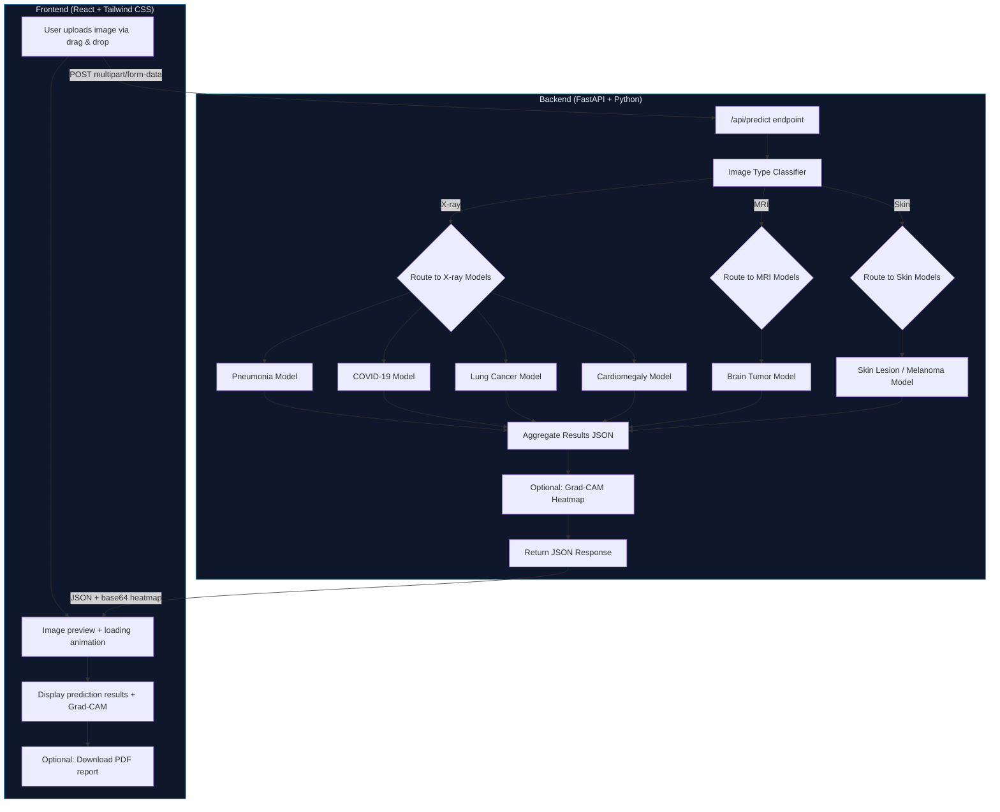

# 🏥 Healthcare Deep Learning — Medical Image Diagnosis System

## Overview

Build a web application where a user uploads a medical image (X-ray, MRI, or skin photo) and the system **automatically detects the image type**, routes it to the correct disease model(s), and returns prediction probabilities — **without asking the user to choose anything**.

---

## 🏗️ System Architecture



---

## 📁 Project Folder Structure

```
d:\healthcareDeep_Learning\main\
├── backend/
│   ├── app/
│   │   ├── __init__.py
│   │   ├── main.py                  # FastAPI app entry point
│   │   ├── config.py                # Settings & constants
│   │   ├── routes/
│   │   │   ├── __init__.py
│   │   │   ├── predict.py           # /api/predict endpoint
│   │   │   └── health.py            # /api/health endpoint
│   │   ├── services/
│   │   │   ├── __init__.py
│   │   │   ├── image_classifier.py  # Auto-detect image type (X-ray / MRI / Skin)
│   │   │   ├── model_router.py      # Route image to correct model(s)
│   │   │   ├── predictor.py         # Run inference on disease models
│   │   │   └── gradcam.py           # Grad-CAM heatmap generation
│   │   ├── models/
│   │   │   ├── __init__.py
│   │   │   └── schemas.py           # Pydantic request/response schemas
│   │   └── utils/
│   │       ├── __init__.py
│   │       ├── image_processing.py  # Resize, normalize, transforms
│   │       ├── logger.py            # Logging setup
│   │       └── pdf_report.py        # PDF report generation
│   ├── trained_models/              # .pth model weights (gitignored, downloaded at startup)
│   │   └── .gitkeep
│   ├── requirements.txt
│   ├── Dockerfile                   # For Render/Railway deployment
│   └── .env.example
│
├── frontend/
│   ├── public/
│   ├── src/
│   │   ├── components/
│   │   │   ├── UploadZone.jsx       # Drag & drop upload area
│   │   │   ├── ImagePreview.jsx     # Shows uploaded image
│   │   │   ├── PredictionResults.jsx# Probability bars & percentages
│   │   │   ├── GradCamView.jsx      # Grad-CAM heatmap overlay
│   │   │   ├── LoadingSpinner.jsx   # Animated loading state
│   │   │   ├── MedicalDisclaimer.jsx# Legal disclaimer banner
│   │   │   ├── Header.jsx           # App header / nav
│   │   │   └── Footer.jsx           # Footer with credits
│   │   ├── pages/
│   │   │   └── Home.jsx             # Main single-page layout
│   │   ├── services/
│   │   │   └── api.js               # Axios calls to backend
│   │   ├── App.jsx
│   │   ├── main.jsx
│   │   └── index.css                # Tailwind + custom styles
│   ├── tailwind.config.js
│   ├── postcss.config.js
│   ├── vite.config.js
│   ├── package.json
│   └── index.html
│
├── training/                        # Model training scripts (PyTorch)
│   ├── config.py                    # Hyperparams, paths, device
│   ├── dataset.py                   # Custom PyTorch Dataset + augmentations
│   ├── train.py                     # Generic training loop (reusable)
│   ├── evaluate.py                  # Metrics: Precision, Recall, F1, ROC-AUC
│   ├── train_image_classifier.py    # Train image-type classifier (X-ray/MRI/Skin)
│   ├── train_brain_tumor.py         # Train brain tumor model
│   ├── train_pneumonia.py           # Train pneumonia model
│   ├── train_covid.py               # Train COVID-19 model
│   ├── train_skin_lesion.py         # Train skin lesion / melanoma model
│   ├── train_lung_cancer.py         # Train lung cancer model
│   ├── train_cardiomegaly.py        # Train cardiomegaly model
│   └── requirements.txt
│
├── datasets/                        # Raw / processed datasets (gitignored)
│   └── README.md                    # Download links & instructions
│
└── README.md                        # Full project documentation
```

## 🧠 Model Details

| # | Disease | Image Type | Architecture | Dataset Source |
|---|---------|-----------|--------------|----------------|
| 0 | **Image Type Classifier** | Any | EfficientNet-B0 | Combined samples from all datasets |
| 1 | Brain Tumor | MRI | ResNet50 | [Kaggle Brain Tumor MRI](https://www.kaggle.com/datasets/masoudnickparvar/brain-tumor-mri-dataset) |
| 2 | Pneumonia | Chest X-ray | EfficientNet-B0 | [Kaggle Chest X-ray](https://www.kaggle.com/datasets/paultimothymooney/chest-xray-pneumonia) |
| 3 | COVID-19 | Chest X-ray | EfficientNet-B0 | [COVID-19 Radiography](https://www.kaggle.com/datasets/tawsifurrahman/covid19-radiography-database) |
| 4 | Skin Lesion | Skin photo | EfficientNet-B0 | [ISIC 2019 / HAM10000](https://www.kaggle.com/datasets/kmader/skin-cancer-mnist-ham10000) |
| 5 | Lung Cancer | CT/X-ray | ResNet50 | [IQ-OTHNCCD Lung Cancer](https://www.kaggle.com/datasets/adityamahimkar/iqothnccd-lung-cancer-dataset) |
| 6 | Cardiomegaly | Chest X-ray | EfficientNet-B0 | [NIH ChestX-ray14 (filtered)](https://www.kaggle.com/datasets/nih-chest-xrays/data) |

Each model uses:
- **Transfer learning** (pretrained on ImageNet)
- **Data augmentation** (random flip, rotation, color jitter, normalization)
- **Training**: Adam optimizer, CrossEntropyLoss, ReduceLROnPlateau scheduler
- **Metrics**: Accuracy, Precision, Recall, F1-Score, ROC-AUC
- **Output**: Softmax probabilities per class

---

## 📊 API Response Format

```json
{
  "image_type": "xray",
  "predictions": {
    "Pneumonia": 0.87,
    "COVID-19": 0.12,
    "Lung Cancer": 0.08,
    "Cardiomegaly": 0.03
  },
  "top_prediction": {
    "disease": "Pneumonia",
    "confidence": 0.87
  },
  "gradcam_image": "data:image/png;base64,iVBOR...",
  "disclaimer": "This is an AI-assisted screening tool. Results are NOT a medical diagnosis. Please consult a qualified healthcare professional."
}
```

---

## 🚀 Phased Implementation Plan

### Phase 1 — Project Setup & Scaffolding
> **Goal**: Get both frontend and backend running locally with Hello World endpoints.

| Step | What | Details |
|------|------|---------|
| 1.1 | Initialize backend | Create FastAPI app, install dependencies, `/api/health` endpoint |
| 1.2 | Initialize frontend | Create Vite + React + Tailwind app, basic page shell |
| 1.3 | Verify connectivity | Frontend calls backend health endpoint successfully |

---

### Phase 2 — Backend Core (Dummy Models)
> **Goal**: Complete backend pipeline with dummy (untrained) models returning random probabilities.

| Step | What | Details |
|------|------|---------|
| 2.1 | Image preprocessing utils | Resize, normalize, PyTorch transforms |
| 2.2 | Dummy model loader | Load EfficientNet-B0 / ResNet50 with random weights, wrap in inference function |
| 2.3 | Image type classifier service | Classify uploaded image as X-ray / MRI / Skin |
| 2.4 | Model router service | Based on image type, run correct disease model(s) |
| 2.5 | `/api/predict` endpoint | Accept image upload, return JSON predictions |
| 2.6 | Pydantic schemas | Request/response models |
| 2.7 | Error handling & logging | Structured logging, exception handlers |

---

### Phase 3 — Frontend UI
> **Goal**: Beautiful, responsive medical-themed UI with full upload → results flow.

| Step | What | Details |
|------|------|---------|
| 3.1 | Design system | Color palette (medical blue/teal), typography, Tailwind config |
| 3.2 | Layout (Header + Footer) | App shell with medical disclaimer |
| 3.3 | UploadZone component | Drag & drop + click-to-upload with file validation |
| 3.4 | ImagePreview component | Show uploaded image thumbnail |
| 3.5 | LoadingSpinner component | Animated DNA/heartbeat loading animation |
| 3.6 | PredictionResults component | Horizontal probability bars with percentages |
| 3.7 | GradCamView component | Overlay heatmap on original image |
| 3.8 | MedicalDisclaimer component | Warning banner |
| 3.9 | API service layer | Axios POST to `/api/predict` |
| 3.10 | Integration | Wire everything together on Home page |

---

### Phase 4 — Model Training Scripts
> **Goal**: Provide complete, runnable training scripts for all 7 models.

| Step | What | Details |
|------|------|---------|
| 4.1 | Shared training infrastructure | Dataset class, training loop, evaluation metrics, config |
| 4.2 | Image type classifier training | 3-class classifier (X-ray, MRI, Skin) |
| 4.3 | Brain tumor model training | 4-class (glioma, meningioma, pituitary, no tumor) |
| 4.4 | Pneumonia model training | 2-class (Normal, Pneumonia) |
| 4.5 | COVID-19 model training | 3-class (Normal, COVID, Viral Pneumonia) |
| 4.6 | Skin lesion model training | Multi-class (melanoma, nevus, etc.) |
| 4.7 | Lung cancer model training | 3-class (Normal, Benign, Malignant) |
| 4.8 | Cardiomegaly model training | 2-class (Normal, Cardiomegaly) |
| 4.9 | Dataset README | Download links & folder structure instructions |

---

### Phase 5 — Advanced Features
> **Goal**: Grad-CAM visualization and PDF report generation.

| Step | What | Details |
|------|------|---------|
| 5.1 | Grad-CAM implementation | Generate heatmap from last conv layer |
| 5.2 | PDF report generation | Include image, predictions, heatmap, disclaimer |
| 5.3 | Download report button | Frontend button to trigger PDF download |

---

### Phase 6 — Deployment
> **Goal**: Deploy for free on Render (backend) + Vercel (frontend).

| Step | What | Details |
|------|------|---------|
| 6.1 | Backend Dockerfile | Multi-stage build, model download on startup |
| 6.2 | Render deployment config | `render.yaml` or manual setup instructions |
| 6.3 | Frontend Vercel config | Environment variables, build settings |
| 6.4 | Deployment README | Step-by-step free deployment guide |

---

## Open Questions

> [!IMPORTANT]
> **1. Model Weights Storage**: Trained `.pth` files can be 80-200 MB each. For deployment, should we:
> - **(A)** Host them on Google Drive / HuggingFace and download at server startup?
> - **(B)** Include them in the Docker image (larger image, but simpler)?
> 
> **Recommendation**: Option A (download at startup) to keep the repo and Docker image small.

> [!IMPORTANT]
> **2. Dummy Models vs Real Training**: Should I:
> - **(A)** Build the full pipeline with dummy models first (so you can test the UI/API immediately), then provide training scripts separately?
> - **(B)** Train one model first as a proof of concept, then build the rest?
>
> **Recommendation**: Option A — get the full app working end-to-end first.

> [!IMPORTANT]
> **3. Image Type Classifier Approach**: For auto-detecting whether an uploaded image is an X-ray, MRI, or skin photo, should we use:
> - **(A)** A trained CNN classifier (most accurate, but needs its own dataset)
> - **(B)** A simpler heuristic + CNN hybrid (analyze color channels + basic classifier)
>
> **Recommendation**: Option A — train a small classifier model.

---

## Verification Plan

### Automated Tests
- Backend: `pytest` tests for `/api/predict` and `/api/health` endpoints
- Frontend: Manual browser testing via the browser tool
- Model training: Verify training scripts run on a small sample of data

### Manual Verification
1. Upload sample X-ray → verify correct routing to X-ray models
2. Upload sample MRI → verify correct routing to Brain Tumor model
3. Upload sample skin photo → verify correct routing to Skin Lesion model
4. Verify Grad-CAM heatmap renders correctly
5. Verify PDF report downloads
6. Test responsive design on mobile viewport
7. Verify deployment on Render + Vercel
