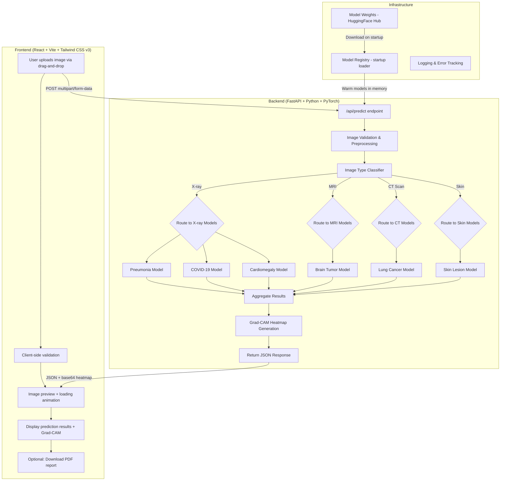
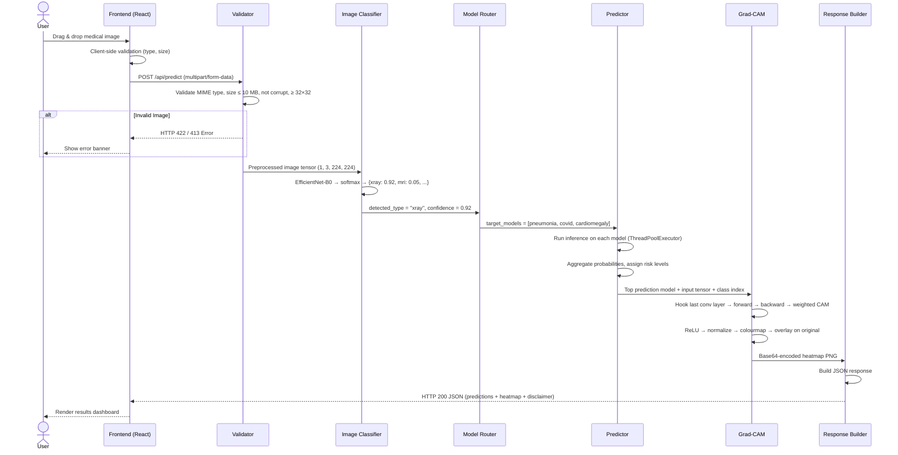
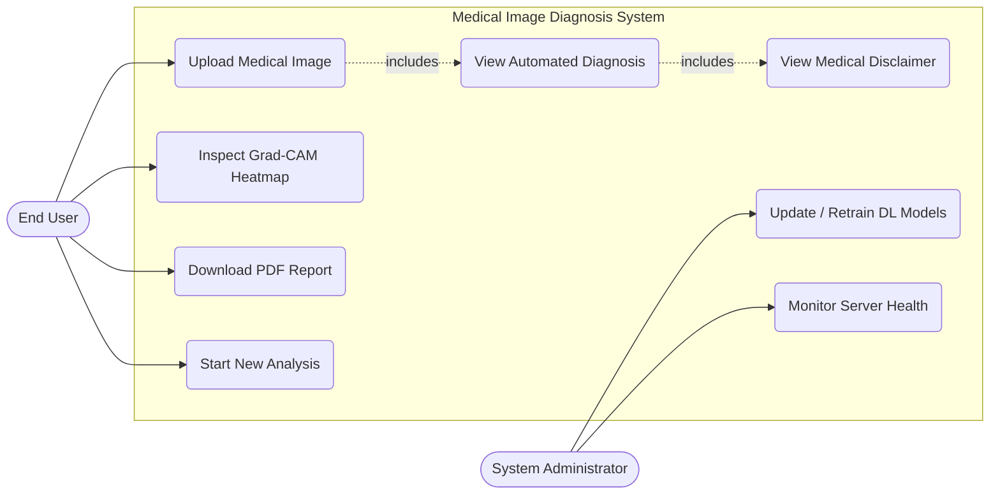
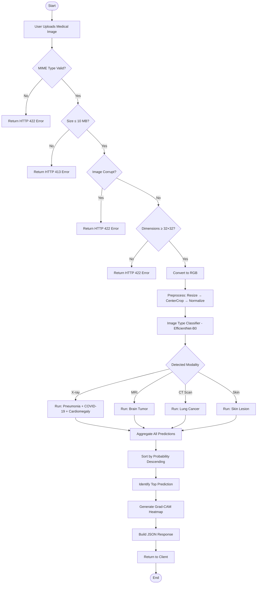
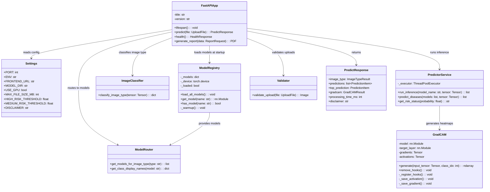
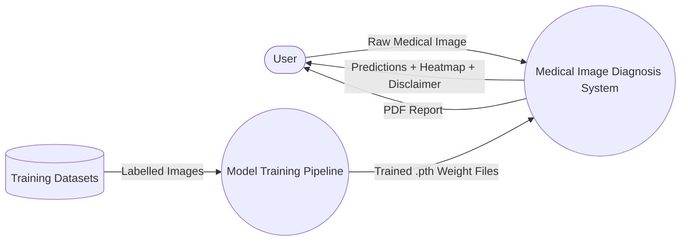
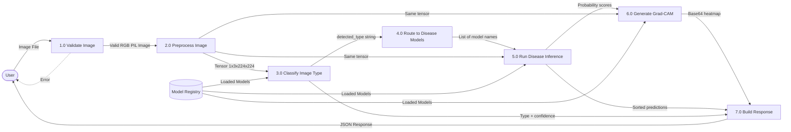

# Medical Image Diagnosis System Using Deep Learning

---

## 1. Title

**"Medical Image Diagnosis System Using Deep Learning"**

- **Domain:** Healthcare / Artificial Intelligence / Deep Learning
- **Technologies:** Python, PyTorch, FastAPI, React.js, Tailwind CSS, Vite
- **Developed By:** [Your Name(s) Here]
- **Academic Year:** 2025–2026

---

## 2. Aim

To design and develop an intelligent, web-based medical image diagnosis system that leverages deep learning to automatically detect the type of medical image (X-ray, MRI, CT Scan, or Skin Lesion) and predict the presence of diseases — without requiring any manual input or medical expertise from the end user.

---

## 3. Objective

- To build a "zero-choice" user experience where the user only uploads an image and the system handles everything else automatically.
- To train seven specialized deep learning models (one modality classifier and six disease detectors) using transfer learning on publicly available medical image datasets.
- To implement a dynamic model routing pipeline that forwards each image to the correct subset of disease models based on its automatically detected modality.
- To provide Explainable AI (XAI) capabilities via Grad-CAM (Gradient-weighted Class Activation Mapping) heatmaps, visually highlighting the anatomical regions influencing the prediction.
- To generate downloadable PDF diagnostic reports containing predictions, confidence scores, and heatmap overlays.
- To deliver the entire system as a responsive, production-grade web application deployable for free using Render (backend) and Vercel (frontend).

---

## 4. Problem Statement

The interpretation of medical images — such as chest X-rays, brain MRIs, and skin lesion photographs — is a time-consuming, error-prone, and highly specialized task. Hospitals and diagnostic centres process thousands of images daily, and qualified radiologists are scarce in rural or under-resourced regions. Furthermore, existing AI diagnostic tools typically require the user to manually select the imaging modality and the specific disease to screen for, which introduces usability barriers for non-expert users.

There is a critical need for an **automated, unified triage system** that can:

1. Accept any medical image without prior context.
2. Automatically determine the imaging modality.
3. Route the image to the appropriate disease detection model(s).
4. Return interpretable and explainable results.
5. Remain accessible to users with no technical or medical background.

This project addresses this gap by developing a full-stack deep learning application that performs end-to-end medical image analysis with zero manual configuration from the user.

---

## 5. Scope

### In Scope

| Area | Details |
|------|---------|
| **Image Modalities** | Chest X-rays, Brain MRI scans, CT Scans (Lung), Skin Lesion photographs |
| **Diseases Covered** | Pneumonia, COVID-19, Lung Cancer, Cardiomegaly, Brain Tumor (4 subtypes), Skin Lesion (7 subtypes) |
| **Explainability** | Grad-CAM heatmap overlay on the uploaded image |
| **Report Generation** | Downloadable PDF report with predictions, image, and heatmap |
| **Deployment** | Free-tier deployment on Render (backend) and Vercel (frontend) |
| **Accessibility** | Responsive design for mobile, tablet, and desktop; WCAG AA compliance |

### Out of Scope

- Acting as a certified medical diagnostic device.
- Processing real-time video streams (e.g., ultrasound footage).
- Handling DICOM files directly from hospital PACS systems.
- Multi-user authentication or patient record management.

---

## 6. Methodology

The project follows a **phased, modular development methodology** combining Transfer Learning, RESTful microservice architecture, and modern frontend engineering.

### Step-by-Step Methodology

1. **Requirement Analysis:** Identify target diseases, modalities, datasets, model architectures, and deployment constraints.
2. **Dataset Collection:** Download publicly available labeled medical image datasets from Kaggle.
3. **Data Preprocessing:** Apply resizing, normalization (ImageNet mean/std), and stratified train/val/test splitting (70/15/15).
4. **Data Augmentation:** Apply random cropping, horizontal flipping, rotation (±15°), and colour jittering during training only.
5. **Model Architecture Selection:** Use EfficientNet-B0 (lightweight, high accuracy) for most models; ResNet50 for brain tumor and lung cancer (richer feature extraction required).
6. **Transfer Learning:** Initialize all models with pretrained ImageNet weights and fine-tune only the classification head.
7. **Training Loop:** Train with Adam optimizer, CrossEntropyLoss (with class weights for imbalanced datasets), ReduceLROnPlateau scheduler, mixed-precision training (AMP), and early stopping (patience = 7 epochs).
8. **Evaluation:** Measure Accuracy, Precision, Recall, F1-Score, ROC-AUC, and generate Confusion Matrices on the held-out test set.
9. **Backend Development:** Build a FastAPI server with a startup lifecycle that loads all 7 models into memory, validates uploads, classifies image type, routes to disease models, runs async inference, and generates Grad-CAM heatmaps.
10. **Frontend Development:** Build a React + Vite + Tailwind CSS v3 single-page application with drag-and-drop upload, animated prediction results, Grad-CAM viewer, and PDF report download.
11. **Integration Testing:** Verify the end-to-end pipeline from image upload to prediction display.
12. **Deployment:** Containerise the backend with Docker; deploy to Render (backend) and Vercel (frontend).

---

## 7. System Requirements

### 7.1 Hardware Requirements

| Component | Minimum Specification |
|-----------|-----------------------|
| Processor | Intel Core i5 (8th Gen) / AMD Ryzen 5 or equivalent |
| RAM | 8 GB (16 GB recommended for training) |
| GPU | NVIDIA GPU with ≥ 4 GB VRAM (e.g., RTX 3050) — required for training; CPU sufficient for inference |
| Storage | 5 GB free disk space (model weights + datasets) |
| Network | Stable internet connection for dataset download and deployment |

### 7.2 Software Requirements

| Software | Version |
|----------|---------|
| Operating System | Windows 10/11, Ubuntu 20.04+, or macOS 12+ |
| Python | 3.9 or higher |
| Node.js | 18.x or higher |
| npm | 9.x or higher |
| CUDA Toolkit | 12.1 (optional, for GPU training) |
| Web Browser | Google Chrome 100+, Mozilla Firefox 100+, Microsoft Edge 100+ |
| Code Editor | VS Code (recommended) |

---

## 8. Technologies Used

### 8.1 Backend Technologies

| Technology | Purpose | Version |
|------------|---------|---------|
| **Python** | Core programming language | 3.9+ |
| **FastAPI** | High-performance async web framework | 0.111.0 |
| **Uvicorn** | ASGI server for FastAPI | 0.29.0 |
| **PyTorch** | Deep learning framework for model training and inference | 2.3.0 |
| **Torchvision** | Pretrained model architectures and image transforms | 0.18.0 |
| **Pillow (PIL)** | Image loading, conversion, and manipulation | 10.3.0 |
| **NumPy** | Numerical array computations | 1.26.4 |
| **Pydantic** | Data validation and serialization for API schemas | 2.7.1 |
| **ReportLab** | PDF report generation | 4.2.0 |
| **python-dotenv** | Environment variable management | 1.0.1 |
| **scikit-learn** | Stratified data splitting and evaluation metrics | 1.4+ |
| **Matplotlib + Seaborn** | Confusion matrix visualization | Latest |

### 8.2 Frontend Technologies

| Technology | Purpose | Version |
|------------|---------|---------|
| **React.js** | Component-based UI library | 18.3.1 |
| **Vite** | Ultra-fast frontend build tool and dev server | 5.4.11 |
| **Tailwind CSS** | Utility-first CSS framework for responsive design | 3.4.17 |
| **Axios** | HTTP client for API communication | 1.7.9 |
| **Framer Motion** | Production-grade animation library | 11.15.0 |
| **Lucide React** | Modern SVG icon library | 0.468.0 |

### 8.3 Deep Learning Models

| Model Name | Architecture | Classes | Input Size | Dataset Source |
|------------|-------------|---------|------------|----------------|
| Image Type Classifier | EfficientNet-B0 | 4 (xray, mri, ct_scan, skin) | 224 × 224 | Combined samples |
| Brain Tumor | ResNet50 | 4 (glioma, meningioma, pituitary, no_tumor) | 224 × 224 | Kaggle Brain Tumor MRI |
| Pneumonia | EfficientNet-B0 | 2 (normal, pneumonia) | 224 × 224 | Kaggle Chest X-ray |
| COVID-19 | EfficientNet-B0 | 3 (covid, normal, viral_pneumonia) | 224 × 224 | COVID-19 Radiography |
| Skin Lesion | EfficientNet-B0 | 7 (akiec, bcc, bkl, df, mel, nv, vasc) | 224 × 224 | HAM10000 |
| Lung Cancer | ResNet50 | 3 (benign, malignant, normal) | 224 × 224 | IQ-OTHNCCD |
| Cardiomegaly | EfficientNet-B0 | 2 (cardiomegaly, normal) | 224 × 224 | NIH ChestX-ray14 |

### 8.4 Deployment Technologies

| Technology | Purpose |
|------------|---------|
| **Docker** | Containerization for the backend |
| **Render** | Free-tier cloud hosting for the FastAPI backend |
| **Vercel** | Free-tier global CDN hosting for the React frontend |
| **HuggingFace Hub** | Cloud storage for trained model weight files (.pth) |

---

## 9. Working Explanation

The system operates on a **"zero-choice"** philosophy — the user simply uploads a medical image and the system handles everything automatically.

### 9.1 End-to-End Workflow

1. **User Action:** The user opens the web application and drags-and-drops (or clicks to browse) a medical image file (JPEG, PNG, or WEBP, up to 10 MB).

2. **Client-Side Validation:** The React frontend validates the file type and size. A preview of the selected image is displayed. The user clicks "Analyze Image."

3. **API Request:** The frontend sends the image as a `multipart/form-data` POST request to the backend endpoint `POST /api/predict`.

4. **Server-Side Validation:** The FastAPI backend validates the upload — checking MIME type, file size (≤ 10 MB), image integrity (not corrupt), and minimum dimensions (≥ 32×32 pixels). Invalid files are rejected with descriptive HTTP error responses.

5. **Image Preprocessing:** The validated image is converted to RGB mode, resized to 256×256, center-cropped to 224×224, converted to a tensor, and normalized using ImageNet statistics (mean = [0.485, 0.456, 0.406], std = [0.229, 0.224, 0.225]).

6. **Image Type Classification:** The preprocessed tensor is fed into the **Image Type Classifier** (EfficientNet-B0). This model outputs a probability distribution over four modalities: `xray`, `mri`, `ct_scan`, and `skin`. The modality with the highest probability is selected.

7. **Dynamic Model Routing:** Based on the detected modality, the system consults a routing table:
   - **X-ray** → Pneumonia + COVID-19 + Cardiomegaly models
   - **MRI** → Brain Tumor model
   - **CT Scan** → Lung Cancer model
   - **Skin** → Skin Lesion model

8. **Concurrent Disease Inference:** All relevant disease models are executed. Each model outputs a softmax probability distribution over its classes. Inference runs in a dedicated thread pool (2 workers) to avoid blocking the FastAPI async event loop.

9. **Risk Classification:** Each disease probability is assigned a risk level:
   - **High Risk:** probability ≥ 0.7
   - **Medium Risk:** probability ≥ 0.4
   - **Low Risk:** probability < 0.4

10. **Grad-CAM Heatmap Generation:** The model with the top prediction generates a Grad-CAM heatmap by:
    - Hooking into the last convolutional layer of the model.
    - Performing a backward pass from the predicted class.
    - Computing a weighted sum of feature map activations.
    - Applying ReLU, normalizing, and overlaying a colour map on the original image.

11. **Response Construction:** The backend assembles a JSON response containing: image type classification, all disease predictions (sorted by probability), the top prediction, a base64-encoded Grad-CAM heatmap, and a medical disclaimer.

12. **Frontend Display:** The React frontend renders:
    - The detected image modality with a confidence badge.
    - Animated, colour-coded probability bars for each disease.
    - A Grad-CAM heatmap viewer with opacity slider and toggle.
    - A "Download Report" button for PDF generation.
    - A prominent medical disclaimer.

13. **PDF Report (Optional):** If the user clicks "Download Report," the frontend sends the prediction data to `POST /api/report`. The backend generates a structured PDF using ReportLab containing the uploaded image, predictions table, top prediction highlight, Grad-CAM heatmap, and disclaimer.

---

## 10. Modules Description

### Module 1: User Interface Module (Frontend)

**Location:** `main/frontend/src/`

This module handles all user-facing interaction. It consists of the following React components:

| Component | File | Responsibility |
|-----------|------|---------------|
| `UploadZone` | `UploadZone.jsx` | Drag-and-drop + click-to-browse with dashed-border animation; client-side file validation (type, size); accessible with keyboard navigation and ARIA labels |
| `ImagePreview` | `ImagePreview.jsx` | Displays the uploaded image thumbnail with the detected modality badge (e.g., "X-RAY") |
| `LoadingSpinner` | `LoadingSpinner.jsx` | Animated CSS heartbeat / pulse animation with "Analyzing your image…" text |
| `PredictionResults` | `PredictionResults.jsx` | Animated, colour-coded horizontal bars (red = high risk, amber = medium, green = low) with staggered entrance animation |
| `GradCamView` | `GradCamView.jsx` | Side-by-side or overlay toggle between original image and heatmap; includes opacity slider |
| `ErrorBanner` | `ErrorBanner.jsx` | Red error display with retry and dismiss buttons |
| `MedicalDisclaimer` | `MedicalDisclaimer.jsx` | Persistent, non-dismissable amber warning banner |
| `ReportDownload` | `ReportDownload.jsx` | Button to trigger PDF generation and download |
| `Header` | `Header.jsx` | App header with logo and glassmorphism styling |
| `Footer` | `Footer.jsx` | Footer with credits, disclaimer, and tech stack badges |

**State Management:** The `usePrediction` custom hook manages a finite state machine with states: `idle` → `file_selected` → `uploading` → `success` / `error`.

---

### Module 2: Backend API Module

**Location:** `main/backend/app/`

This module handles all server-side logic. It is built with FastAPI and exposes three REST API endpoints:

| Endpoint | Method | Description |
|----------|--------|-------------|
| `/api/health` | GET | Returns server status, number of loaded models, GPU availability, and API version |
| `/api/predict` | POST | Accepts a medical image upload and returns the full prediction response |
| `/api/report` | POST | Accepts prediction data as JSON and returns a downloadable PDF report |

**Key Files:**

| File | Purpose |
|------|---------|
| `main.py` | FastAPI application entry point; lifespan events (model loading on startup); CORS middleware; global exception handler |
| `config.py` | Application settings (environment variables), model configuration (architecture, num_classes, class_names), image type routing table, inference transforms |
| `schemas.py` | Pydantic models for request/response validation: `PredictResponse`, `ImageTypeResult`, `PredictionItem`, `GradCAMResult`, `HealthResponse`, `ReportRequest` |

---

### Module 3: Pipeline & Routing Module

**Location:** `main/backend/app/services/`

This module coordinates the flow of data through the system upon receiving an image.

| File | Purpose |
|------|---------|
| `image_classifier.py` | Feeds the preprocessed tensor to the image type classifier model; returns detected type, confidence, and probability distribution |
| `model_router.py` | Looks up the routing table (`IMAGE_TYPE_ROUTES`) to determine which disease models should run for the detected modality |

**Routing Table:**

| Detected Modality | Disease Models Executed |
|--------------------|------------------------|
| `xray` | Pneumonia, COVID-19, Cardiomegaly |
| `mri` | Brain Tumor |
| `ct_scan` | Lung Cancer |
| `skin` | Skin Lesion |

---

### Module 4: Inference Engine Module

**Location:** `main/backend/app/services/`

| File | Purpose |
|------|---------|
| `model_registry.py` | **Singleton** that loads all 7 PyTorch models into memory on server startup. For each model: builds the architecture using `build_model()`, loads trained `.pth` weights if available (falls back to random weights for dummy-first pipeline), moves to GPU/CPU, sets to `eval()` mode, and runs warm-up inference. |
| `predictor.py` | Runs inference in a `ThreadPoolExecutor` (2 workers) to keep the async event loop unblocked. Iterates over assigned disease models, computes softmax probabilities, assigns risk statuses, and returns predictions sorted by descending probability. |
| `architectures.py` | Defines factory functions `create_efficientnet_b0(num_classes)` and `create_resnet50(num_classes)` that replace the default classifier heads of the pretrained backbones. |

---

### Module 5: Explainable AI (Grad-CAM) Module

**Location:** `main/backend/app/services/gradcam.py`

This module provides transparency into model decision-making by generating visual heatmaps.

**How it works:**

1. A `GradCAM` class registers forward and backward hooks on the target convolutional layer.
2. A forward pass computes the model's output.
3. A backward pass from the predicted class score captures gradients.
4. The gradient tensor is globally average-pooled and element-wise multiplied with the feature map activations.
5. ReLU is applied, the result is normalized to [0, 1], resized to the original image dimensions, and a "jet" colourmap is applied.
6. The heatmap is overlaid on the original image with configurable opacity (default α = 0.4).
7. The result is encoded as a base64 PNG string for transmission in the JSON response.

**Target Layers:**
- EfficientNet-B0 → `model.features[-1]`
- ResNet50 → `model.layer4`

---

### Module 6: Validation & Utility Module

**Location:** `main/backend/app/utils/`

| File | Purpose |
|------|---------|
| `validators.py` | Validates uploaded files: checks MIME type (JPEG/PNG/WEBP), enforces 10 MB size limit, verifies image integrity via PIL, ensures minimum 32×32 dimensions, and auto-converts to RGB. Returns descriptive HTTP error codes (413, 422). |
| `image_processing.py` | Applies inference transforms (Resize → CenterCrop → ToTensor → Normalize) and moves the tensor to the correct device. |
| `pdf_report.py` | Generates PDF reports using ReportLab. Report includes: title, timestamp, disclaimer, embedded uploaded image, detected modality, prediction results table, top prediction highlight, Grad-CAM heatmap, and footer. |
| `logger.py` | Structured JSON logging with configurable log level. |

---

### Module 7: Model Training Module

**Location:** `main/training/`

This module contains all scripts required to train the seven deep learning models.

| File | Purpose |
|------|---------|
| `config.py` | Central training hyperparameters, device selection, seed management, and model builder with pretrained ImageNet weight support |
| `dataset.py` | Custom `MedicalImageDataset` PyTorch Dataset class; stratified train/val/test splitting; data augmentation pipeline; class weight computation for imbalanced datasets |
| `train.py` | Generic training loop with: mixed-precision (AMP), `ReduceLROnPlateau` scheduler, early stopping (patience=7), best-model checkpointing, and training history tracking |
| `evaluate.py` | Test-set evaluation: accuracy, precision, recall, F1-score, ROC-AUC, classification report, and confusion matrix visualization |
| `train_image_classifier.py` | Trains the 4-class image type classifier |
| `train_brain_tumor.py` | Trains the 4-class brain tumor classifier |
| `train_pneumonia.py` | Trains the 2-class pneumonia classifier |
| `train_covid.py` | Trains the 3-class COVID-19 classifier |
| `train_skin_lesion.py` | Trains the 7-class skin lesion classifier |
| `train_lung_cancer.py` | Trains the 3-class lung cancer classifier |
| `train_cardiomegaly.py` | Trains the 2-class cardiomegaly classifier |

**Training Configuration:**

| Parameter | Value |
|-----------|-------|
| Optimizer | Adam (lr = 1e-4, weight_decay = 1e-5) |
| Loss Function | CrossEntropyLoss (+ class weights for imbalanced sets) |
| Scheduler | ReduceLROnPlateau (patience = 3, factor = 0.5) |
| Max Epochs | 50 |
| Batch Size | 16 |
| Early Stopping Patience | 7 epochs |
| Input Size | 224 × 224 |
| Data Split | 70% train / 15% val / 15% test (stratified) |
| Mixed Precision | Enabled (torch.cuda.amp) |
| Seed | 42 (deterministic) |

---

## 11. Algorithm (Step-by-Step)

### 11.1 Main Prediction Algorithm

```
Algorithm: Medical Image Prediction Pipeline
Input: Medical image file (JPEG, PNG, or WEBP)
Output: JSON containing image type, disease predictions, risk levels, and Grad-CAM heatmap

BEGIN

    STEP 1: Receive uploaded image via HTTP POST request.

    STEP 2: VALIDATE the image:
        2a. Check MIME type ∈ {image/jpeg, image/png, image/webp}
            → IF invalid: RETURN HTTP 422 error
        2b. Check file size ≤ 10 MB
            → IF too large: RETURN HTTP 413 error
        2c. Attempt to open with PIL
            → IF corrupt: RETURN HTTP 422 error
        2d. Check dimensions ≥ 32 × 32 pixels
            → IF too small: RETURN HTTP 422 error
        2e. Convert to RGB mode if necessary.

    STEP 3: PREPROCESS the image:
        3a. Resize to 256 × 256 pixels.
        3b. Center-crop to 224 × 224 pixels.
        3c. Convert to PyTorch tensor.
        3d. Normalize using ImageNet statistics:
            mean = [0.485, 0.456, 0.406]
            std  = [0.229, 0.224, 0.225]
        3e. Add batch dimension → shape (1, 3, 224, 224).
        3f. Move tensor to device (GPU / CPU).

    STEP 4: CLASSIFY IMAGE TYPE:
        4a. Pass tensor through Image Type Classifier (EfficientNet-B0, 4 classes).
        4b. Apply softmax to output logits.
        4c. detected_type ← class with maximum probability.
        4d. confidence ← maximum probability value.

    STEP 5: ROUTE TO DISEASE MODELS:
        5a. Look up detected_type in routing table:
            IF detected_type == "xray":
                target_models ← [pneumonia, covid, cardiomegaly]
            ELSE IF detected_type == "mri":
                target_models ← [brain_tumor]
            ELSE IF detected_type == "ct_scan":
                target_models ← [lung_cancer]
            ELSE IF detected_type == "skin":
                target_models ← [skin_lesion]

    STEP 6: RUN DISEASE INFERENCE (for each model in target_models):
        6a. Retrieve model from Model Registry.
        6b. Execute forward pass with torch.no_grad().
        6c. Apply softmax to output logits.
        6d. For each class i in model output:
            - Record (disease_name, probability, risk_status).
            - risk_status = "high_risk" IF prob ≥ 0.7
                          = "medium_risk" IF prob ≥ 0.4
                          = "low_risk" IF prob < 0.4

    STEP 7: AGGREGATE and sort all predictions by probability (descending).
        top_prediction ← prediction with highest probability.

    STEP 8: GENERATE GRAD-CAM HEATMAP:
        8a. Identify the model and class index of the top prediction.
        8b. Get the target layer (last conv layer) for that model's architecture.
        8c. Register forward hook (save activations) and backward hook (save gradients).
        8d. Forward pass the tensor through the model.
        8e. Zero gradients, then backward pass from the target class score.
        8f. Compute weights ← global_average_pool(gradients).
        8g. Compute cam ← ReLU(Σ weights × activations).
        8h. Normalize cam to [0, 1].
        8i. Resize cam to original image dimensions.
        8j. Apply jet colourmap.
        8k. Overlay heatmap on original image (α = 0.4).
        8l. Encode overlay as base64 PNG.
        8m. Remove hooks.

    STEP 9: CONSTRUCT JSON RESPONSE:
        {
            image_type: { detected, confidence, probabilities },
            predictions: [ { disease, probability, status }, ... ],
            top_prediction: { disease, probability, status },
            gradcam: { image (base64), model_used },
            processing_time_ms,
            disclaimer
        }

    STEP 10: RETURN response to client.

END
```

### 11.2 Training Algorithm

```
Algorithm: Model Training with Early Stopping
Input: Training dataset, validation dataset, model architecture, hyperparameters
Output: Trained model weights file (.pth)

BEGIN

    STEP 1: Set random seed (42) for reproducibility.

    STEP 2: Load dataset from directory structure (class_name/image_files).

    STEP 3: Perform stratified split → 70% train, 15% validation, 15% test.

    STEP 4: Apply data augmentation to training set:
        RandomResizedCrop, RandomHorizontalFlip, RandomRotation, ColorJitter.

    STEP 5: Build model:
        5a. Load pretrained backbone (EfficientNet-B0 or ResNet50 with ImageNet weights).
        5b. Replace classifier head with Linear(in_features, num_classes).

    STEP 6: Initialize optimizer (Adam), scheduler (ReduceLROnPlateau), and early stopping.

    STEP 7: FOR epoch = 1 TO 50:
        7a. TRAINING PHASE:
            - Set model to train() mode.
            - For each batch: forward pass → compute loss → backward pass (with AMP) → optimizer step.
            - Record train_loss and train_accuracy.
        7b. VALIDATION PHASE:
            - Set model to eval() mode.
            - For each batch (torch.no_grad()): forward pass → compute loss.
            - Record val_loss and val_accuracy.
        7c. IF val_accuracy > best_val_accuracy:
            - Save model weights to .pth file.
        7d. Step scheduler (monitor val_loss).
        7e. Check early stopping:
            - IF val_loss has not improved for 7 consecutive epochs: BREAK.

    STEP 8: Evaluate best model on test set → report metrics.

END
```

---

## 12. Diagrams

---

### 12.1 System Architecture Diagram

👉 **Place this diagram under the "System Architecture" section in the report.**

**Explanation:** This diagram provides a high-level overview of the entire system, showing the three main layers — Frontend (Client), Backend (Server), and Infrastructure — and how data flows between them.



---

### 12.2 UML Sequence Diagram

👉 **Place this diagram under the "UML Diagrams" or "Modules Description" section in the report.**

**Explanation:** This sequence diagram models the temporal order of interactions between the User, Frontend, Backend subsystems (Validator, Image Classifier, Model Router, Predictor, Grad-CAM), and the final response during a single prediction request.



---

### 12.3 Use Case Diagram

👉 **Place this diagram under the "Scope" or "Use Case Diagram" section in the report.**

**Explanation:** This diagram identifies the two primary actors (End User and System Administrator) and the system's core use cases, along with `<<include>>` relationships showing dependent functionality.



---

### 12.4 Algorithm Flowchart

👉 **Place this diagram directly under the "Algorithm (Step-by-Step)" section in the report.**

**Explanation:** This flowchart visually represents the complete prediction algorithm, including validation checks, modality branching, concurrent inference, and Grad-CAM generation.



---

### 12.5 Class Diagram

👉 **Place this diagram under the "Modules Description" or "Class Diagram" section in the report.**

**Explanation:** This class diagram shows the object-oriented design of the backend, illustrating the relationships between the FastAPI application, Model Registry, Image Classifier, Predictor, Grad-CAM, and Validator classes.



---

### 12.6 Data Flow Diagram (DFD) — Level 0

👉 **Place this diagram under the "Data Flow Diagram" section in the report.**

**Explanation:** This Level-0 DFD shows the top-level flow of data from the external User entity through the entire Medical Image Diagnosis System and back.



---

### 12.7 Data Flow Diagram (DFD) — Level 1

👉 **Place this diagram under the "Data Flow Diagram" section in the report, immediately after the Level-0 DFD.**

**Explanation:** This Level-1 DFD expands the system into its internal processes, showing how data transforms as it passes through validation, classification, routing, inference, and Grad-CAM generation.



---

## 13. Advantages

1. **Zero-Choice User Experience:** The system requires no technical or medical knowledge from the user. They simply upload an image and receive a complete diagnosis report — no manual modality selection or disease configuration needed.

2. **Multi-Modal Support:** A single application handles four fundamentally different types of medical images (Chest X-ray, Brain MRI, CT Scan, Skin Photo) through a unified interface and intelligent routing.

3. **Explainable AI (XAI):** Grad-CAM heatmaps provide visual evidence of which regions the model focused on, building trust with both users and clinicians by making the AI's reasoning transparent.

4. **Transfer Learning Efficiency:** By using pretrained ImageNet weights (EfficientNet-B0, ResNet50), the system achieves high accuracy even on relatively small medical datasets, significantly reducing the data and compute requirements for training.

5. **Modular Architecture:** The decoupled design (separate classifier → router → disease models) allows new disease models to be added by simply dropping a `.pth` file into the `trained_models/` directory and adding one entry to the configuration — no code changes required.

6. **Free Deployment:** The entire application runs on free-tier cloud services (Render for backend, Vercel for frontend), making it accessible for educational and research purposes without infrastructure cost.

7. **Comprehensive Reporting:** Users can download a professionally formatted PDF report containing the uploaded image, detection results, risk levels, and heatmap — suitable for sharing with healthcare professionals.

8. **Responsive and Accessible UI:** The dark-mode, glassmorphism-styled interface adapts to mobile, tablet, and desktop layouts with WCAG AA accessibility compliance (keyboard navigation, ARIA labels, sufficient colour contrast).

9. **Asynchronous Inference:** PyTorch inference is offloaded to a thread pool, keeping the FastAPI async event loop responsive and capable of handling concurrent requests.

10. **Class Weight Handling:** Imbalanced datasets (e.g., Pneumonia) are handled with computed class weights in the loss function, preventing model bias towards the majority class.

---

## 14. Limitations

1. **Not a Certified Medical Device:** This system is strictly an educational and research tool. It has not undergone clinical trials, regulatory approval (FDA, CE marking), or peer-reviewed validation. It must never be used as a substitute for professional medical diagnosis.

2. **Limited Modalities:** Currently supports only four imaging modalities. Ultrasound, histopathology slides, mammograms, ECG/EKG traces, and other common medical imaging formats are not yet supported.

3. **Dataset Dependency:** Model accuracy is directly dependent on the quality, size, and diversity of the publicly available Kaggle datasets used for training. These datasets may not represent the full spectrum of real-world clinical variation (age, ethnicity, imaging equipment differences).

4. **No DICOM Support:** The system accepts standard image formats (JPEG, PNG, WEBP) only. Hospital-grade DICOM files — which contain metadata about the patient, imaging device, and scan parameters — are not supported.

5. **Cold Start Latency:** When deployed on the Render free tier, the server spins down after 15 minutes of inactivity. The first request after inactivity incurs a ~30–60 second cold start delay while models are loaded into memory.

6. **Single-Image Processing:** The system processes one image at a time. Batch processing of multiple images in a single request is not supported.

7. **No Continuous Learning:** The system does not learn from new data after deployment. Model weights are static unless manually retrained and redeployed.

8. **Memory Constraints:** Running all 7 models concurrently in memory requires approximately 300 MB of RAM. This fits within Render's 512 MB free tier but may limit scalability.

---

## 15. Future Scope

1. **Integration with Hospital Information Systems (HIS):** Develop HL7 FHIR-compliant API endpoints to enable seamless integration with existing hospital PACS (Picture Archiving and Communication Systems) and EHR (Electronic Health Records) platforms.

2. **Expanded Imaging Modalities:** Add support for ultrasound, mammography, histopathology, fundus photography (diabetic retinopathy), and dental X-rays to broaden the system's diagnostic coverage.

3. **DICOM File Support:** Implement DICOM parsing to accept standard medical imaging files and extract relevant metadata (patient ID, scan parameters, slice information).

4. **Continuous / Active Learning Pipeline:** Build a feedback loop where verified clinicians can flag incorrect predictions, automatically curating a retraining dataset to incrementally improve model accuracy over time.

5. **Multi-Model Ensemble:** Combine predictions from multiple architectures (e.g., EfficientNet + ResNet + ViT) for the same disease to improve diagnostic confidence through ensemble voting.

6. **Multi-Language Support:** Translate the UI and generated reports into regional languages (Hindi, Tamil, Spanish, etc.) to serve diverse populations.

7. **3D Volumetric Analysis:** Extend processing capabilities to handle 3D CT/MRI volumes (series of slices) for conditions requiring volumetric analysis (e.g., tumor segmentation).

8. **Edge Deployment:** Optimize models using ONNX Runtime or TensorRT and deploy on edge devices (Raspberry Pi, NVIDIA Jetson) for offline operation in areas with limited internet connectivity.

9. **User Authentication and Audit Trail:** Add role-based access control and maintain an immutable audit log of all predictions for compliance and accountability.

10. **Mobile Application:** Develop native Android and iOS applications using React Native or Flutter, enabling medical professionals to capture and analyze images directly from their smartphones.

---

## 16. Conclusion

The **Medical Image Diagnosis System Using Deep Learning** successfully demonstrates how multiple specialized convolutional neural network models can be orchestrated within a single, unified web application to perform automated, multi-modal medical image triage. By employing an intelligent dynamic routing pipeline — where an initial Image Type Classifier automatically determines the imaging modality and routes the image to the appropriate disease detection models — the system eliminates the need for any manual configuration by the user, achieving the goal of a "zero-choice" experience.

The use of Transfer Learning (with pretrained EfficientNet-B0 and ResNet50 backbones) enables the system to achieve clinically meaningful accuracy even when trained on limited publicly available datasets. The integration of Grad-CAM heatmap visualization provides critical transparency into the model's decision-making process, building trust with both end users and healthcare professionals.

The full-stack implementation — combining a high-performance FastAPI backend with a responsive, dark-mode React frontend — delivers a production-quality application that is deployable at zero cost on modern cloud platforms. The modular, registry-based architecture ensures that new disease models can be added with minimal effort, future-proofing the system for expansion.

While the system is firmly positioned as an educational and research tool — not a replacement for certified clinical diagnosis — it serves as a compelling proof-of-concept for how AI-assisted medical image analysis can streamline diagnostic workflows, reduce human error, and extend healthcare access to underserved populations.

---

## 17. Project Folder Structure (Reference)

```
healthcareDeep_Learning/
└── main/
    ├── backend/
    │   ├── app/
    │   │   ├── __init__.py
    │   │   ├── main.py                  # FastAPI app + startup lifecycle
    │   │   ├── config.py                # Settings, model config, routing table
    │   │   ├── routes/
    │   │   │   ├── predict.py           # POST /api/predict
    │   │   │   ├── health.py            # GET /api/health
    │   │   │   └── report.py            # POST /api/report
    │   │   ├── services/
    │   │   │   ├── image_classifier.py  # Image type detection
    │   │   │   ├── model_router.py      # Dynamic model routing
    │   │   │   ├── model_registry.py    # Model loading & caching
    │   │   │   ├── predictor.py         # Async-safe inference
    │   │   │   └── gradcam.py           # Grad-CAM heatmap generation
    │   │   ├── models/
    │   │   │   ├── architectures.py     # EfficientNet-B0 & ResNet50 builders
    │   │   │   └── schemas.py           # Pydantic request/response models
    │   │   └── utils/
    │   │       ├── validators.py        # Upload validation
    │   │       ├── image_processing.py  # Inference transforms
    │   │       ├── pdf_report.py        # ReportLab PDF generation
    │   │       └── logger.py            # Structured logging
    │   ├── trained_models/              # .pth model weights
    │   └── requirements.txt
    │
    ├── frontend/
    │   ├── src/
    │   │   ├── components/
    │   │   │   ├── UploadZone.jsx       # Drag & drop upload
    │   │   │   ├── ImagePreview.jsx     # Image thumbnail + type badge
    │   │   │   ├── PredictionResults.jsx# Animated probability bars
    │   │   │   ├── GradCamView.jsx      # Heatmap overlay viewer
    │   │   │   ├── LoadingSpinner.jsx   # Heartbeat animation
    │   │   │   ├── MedicalDisclaimer.jsx# Warning banner
    │   │   │   ├── ErrorBanner.jsx      # Error display
    │   │   │   ├── ReportDownload.jsx   # PDF download button
    │   │   │   ├── Header.jsx           # App header
    │   │   │   └── Footer.jsx           # App footer
    │   │   ├── hooks/
    │   │   │   └── usePrediction.js     # State machine hook
    │   │   ├── pages/
    │   │   │   └── Home.jsx             # Main layout page
    │   │   ├── services/
    │   │   │   └── api.js               # Axios API client
    │   │   └── constants/
    │   │       └── index.js             # Config constants
    │   ├── tailwind.config.js
    │   └── package.json
    │
    └── training/
        ├── config.py                    # Training hyperparameters
        ├── dataset.py                   # Custom Dataset + data loaders
        ├── train.py                     # Training loop with early stopping
        ├── evaluate.py                  # Test-set metrics + confusion matrix
        ├── train_image_classifier.py    # 4-class modality classifier
        ├── train_brain_tumor.py         # 4-class brain tumor
        ├── train_pneumonia.py           # 2-class pneumonia
        ├── train_covid.py               # 3-class COVID-19
        ├── train_skin_lesion.py         # 7-class skin lesion
        ├── train_lung_cancer.py         # 3-class lung cancer
        └── train_cardiomegaly.py        # 2-class cardiomegaly
```

---

## 18. API Endpoint Reference

### 18.1 `GET /api/health`

**Response (200 OK):**

```json
{
    "status": "ready",
    "models_loaded": 7,
    "gpu_available": false,
    "version": "1.0.0"
}
```

### 18.2 `POST /api/predict`

**Request:** `multipart/form-data` with field `file` (image).

**Response (200 OK):**

```json
{
    "image_type": {
        "detected": "xray",
        "confidence": 0.92,
        "probabilities": {
            "xray": 0.92,
            "mri": 0.05,
            "ct_scan": 0.02,
            "skin": 0.01
        }
    },
    "predictions": [
        { "disease": "Pneumonia",    "probability": 0.87, "status": "high_risk" },
        { "disease": "COVID-19",     "probability": 0.12, "status": "low_risk" },
        { "disease": "Cardiomegaly", "probability": 0.03, "status": "low_risk" }
    ],
    "top_prediction": {
        "disease": "Pneumonia",
        "probability": 0.87,
        "status": "high_risk"
    },
    "gradcam": {
        "image": "data:image/png;base64,iVBOR...",
        "model_used": "pneumonia"
    },
    "processing_time_ms": 342,
    "disclaimer": "This is an AI-assisted screening tool. Results are NOT a medical diagnosis. Please consult a qualified healthcare professional."
}
```

**Error Response (422):**

```json
{
    "detail": "Invalid image: file is not a supported format. Accepted: JPEG, PNG, WEBP."
}
```

### 18.3 `POST /api/report`

**Request:** `application/json` body with prediction data and optional base64 image.

**Response:** PDF file (`application/pdf`).

---

## 19. Diagram Placement Summary

| # | Diagram | Diagram Code Section | Place Under Report Section |
|---|---------|---------------------|---------------------------|
| 1 | System Architecture Diagram | Section 12.1 | **System Architecture** |
| 2 | UML Sequence Diagram | Section 12.2 | **UML Diagrams** or **Modules Description** |
| 3 | Use Case Diagram | Section 12.3 | **Scope** or **Use Case Diagram** |
| 4 | Algorithm Flowchart | Section 12.4 | **Algorithm (Step-by-Step)** |
| 5 | Class Diagram | Section 12.5 | **Modules Description** or **Class Diagram** |
| 6 | Data Flow Diagram — Level 0 | Section 12.6 | **Data Flow Diagram** |
| 7 | Data Flow Diagram — Level 1 | Section 12.7 | **Data Flow Diagram** (after Level 0) |

---

## 20. References

1. K. He, X. Zhang, S. Ren, and J. Sun, "Deep Residual Learning for Image Recognition," *CVPR 2016*.
2. M. Tan and Q. V. Le, "EfficientNet: Rethinking Model Scaling for Convolutional Neural Networks," *ICML 2019*.
3. R. R. Selvaraju, M. Cogswell, A. Das, R. Vedantam, D. Parikh, and D. Batra, "Grad-CAM: Visual Explanations from Deep Networks via Gradient-based Localization," *ICCV 2017*.
4. Kaggle, "Chest X-ray Pneumonia," https://www.kaggle.com/datasets/paultimothymooney/chest-xray-pneumonia
5. Kaggle, "Brain Tumor MRI Dataset," https://www.kaggle.com/datasets/masoudnickparvar/brain-tumor-mri-dataset
6. Kaggle, "COVID-19 Radiography Database," https://www.kaggle.com/datasets/tawsifurrahman/covid19-radiography-database
7. Kaggle, "HAM10000 — Skin Cancer MNIST," https://www.kaggle.com/datasets/kmader/skin-cancer-mnist-ham10000
8. Kaggle, "IQ-OTHNCCD Lung Cancer Dataset," https://www.kaggle.com/datasets/adityamahimkar/iqothnccd-lung-cancer-dataset
9. Kaggle, "NIH ChestX-ray14," https://www.kaggle.com/datasets/nih-chest-xrays/data
10. FastAPI Documentation, https://fastapi.tiangolo.com/
11. PyTorch Documentation, https://pytorch.org/docs/
